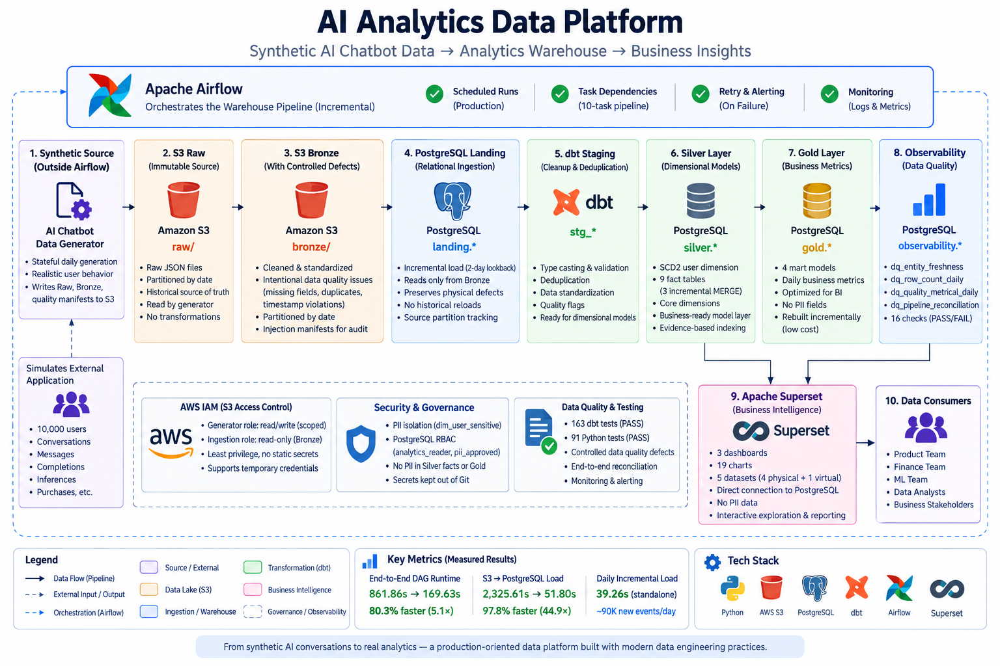

# AI Analytics Data Platform

A production-oriented batch analytics platform for an AI chatbot product. It generates realistic operational data, preserves source and intentionally imperfect records in an S3 medallion lake, incrementally loads PostgreSQL, builds tested dimensional models with dbt, orchestrates the warehouse with Airflow, and serves business metrics in Apache Superset.

The project is designed as a portfolio-scale system: its purpose is not only to produce dashboards, but to make ingestion boundaries, data-quality behavior, historical modeling, performance trade-offs, and access controls explicit and testable.



## Final Architecture

```text
Synthetic Source Generator (outside Airflow)
                  |
                  v
              S3 Raw
                  |
                  v
             S3 Bronze
                  |
                  v
        PostgreSQL Landing
                  |
                  v
            dbt Staging
                  |
                  v
               Silver
                  |
                  v
                Gold
                  |
                  v
           Observability
                  |
                  v
              Superset
```

Airflow runs the warehouse path in this order:

```text
dbt_parse
  -> extract_load
  -> dbt_staging
  -> dbt_user_state_prerequisites
  -> dbt_snapshot
  -> dbt_silver_dimensions
  -> dbt_silver_facts
  -> dbt_gold
  -> dbt_observability
  -> dbt_tests
```

The daily synthetic generator is deliberately outside the production DAG. It represents an external source system delivering a new partition; Airflow begins at the platform's ingestion boundary and does not manufacture its own upstream data.

## Data Flow and Layer Responsibilities

- **Source simulation:** Python creates deterministic reference data, user and product events, inference activity, quality events, and finance records. Stateful daily generation reconstructs prior state so new partitions preserve lifecycle and identifier consistency.
- **S3 Raw:** retains the clean source representation in date-partitioned NDJSON.
- **S3 Bronze:** represents the full ingestion layer. Controlled missing fields, duplicate replays, and timestamp violations are intentionally present so downstream quality handling is observable and testable.
- **PostgreSQL Landing:** copies Bronze records and lineage fields into relational tables without silently cleaning source defects. Daily loads replace only a bounded set of selected partitions.
- **dbt Staging:** explicitly types source columns, deterministically deduplicates replays, recovers fields when an exact relationship permits it, and flags unresolved issues.
- **Silver:** provides conformed dimensions and facts. User history combines reconstructed CDC history with a dbt snapshot for hybrid SCD Type 2 behavior.
- **Gold:** publishes daily product, user-activity, ML, and finance marts at dashboard-ready grains.
- **Observability:** measures freshness, volume, known quality conditions, and cross-layer reconciliation.
- **Superset:** queries the PostgreSQL Gold layer for product, finance, and model-performance analysis.

The quality-injection manifest is an audit and validation truth set. dbt transformations do not consult it to decide how to clean individual records.

## Daily Incremental Cycle

1. The source simulator writes a new `dt=YYYY-MM-DD` Raw partition and its corresponding Bronze records.
2. Airflow runs PostgreSQL landing in incremental mode with a two-day lookback.
3. Landing discovers and reprocesses only the bounded Bronze partitions, retaining physical source lineage.
4. Staging normalizes types, removes deterministic replay duplicates, and carries quality flags forward.
5. User-state prerequisites and the dbt snapshot update the hybrid SCD2 history before dimensions are built.
6. `fact_message`, `fact_completion`, and `fact_model_inference` MERGE recent records by their unique business keys.
7. Smaller facts and Gold marts rebuild because their measured cost remains low and the simpler behavior is easier to reason about.
8. Observability models and dbt tests validate reconciliation, business rules, and dimensional relationships.
9. Superset reads the refreshed PostgreSQL Gold tables directly.

Late-arriving and corrected records are handled with two complementary bounds in each large incremental fact: a two-day business-event-time lookback and a bounded `source_partition_date` safeguard. The partition condition matters because controlled timestamp-defect rows can fall outside an event-time filter even though they arrived in a recent physical partition.

## Architecture Evolution

| Decision | Initial design | Final design | Why it changed |
|---|---|---|---|
| Modeling | Normalized, operational-style source records | Dimensional Silver facts/dimensions and business-grain Gold marts | Analytics queries need stable grains, conformed keys, and reusable metrics. |
| Medallion layers | Generated source files | Raw -> Bronze -> Silver -> Gold, with relational landing and staging boundaries | Separating fidelity, cleanup, modeling, and serving makes defects and reconciliations traceable. |
| User history | Current user state | Hybrid SCD2 history from CDC bootstrap plus dbt snapshot | Historical attribute analysis requires valid, non-overlapping versions while Type 1 and Type 0 semantics remain explicit. |
| Warehouse | DuckDB for initial local development | PostgreSQL | Concurrent orchestration and BI serving required a persistent relational service. DuckDB is no longer an active runtime component. |
| Ingestion | Reload all S3 history | Daily partition-aware incremental loading with a two-day lookback | Full history scans became the dominant runtime as data volume grew. |
| Synthetic data | Fixed historical generation | Stateful, deterministic daily generation | Incremental processing needed realistic new activity that continues existing user and finance lifecycles. |
| Large facts | Full table rebuilds | PostgreSQL/dbt incremental MERGE on business keys | The three million-row-scale event facts benefited from bounded processing and idempotent updates. |
| Airflow | Full-refresh landing in the DAG | Bounded incremental landing before dbt | Production-style daily runs should process the change window while keeping full refresh as recovery. |
| Indexing | No secondary indexes | Four measured, workload-specific indexes | Selective lookups improved sharply, while broad date indexes that did not help were rejected. |
| BI | Development queries | Superset dashboards over Gold | A governed serving layer makes the modeled metrics usable without coupling dashboards to staging logic. |
| PII | Email and name in general `dim_user` | Restricted `dim_user_sensitive` with role-based access | Direct identifiers need a narrower access boundary than general analytical attributes. |
| AWS access | Shared/static-style access assumptions | Component-scoped IAM policy artifacts and the boto3 credential-provider chain | Generation and ingestion have different S3 responsibilities; least privilege and external credential delivery make that boundary explicit. |

## Incremental Facts and Indexing

The high-volume facts `fact_message`, `fact_completion`, and `fact_model_inference` use dbt's PostgreSQL incremental `merge` strategy. Their unique keys are `message_id`, `completion_id`, and `inference_id`, respectively. A full rebuild remains available for recovery or backfill, but it is not the normal daily path.

Only four indexes survived measurement:

- unique `fact_message(message_id)`
- unique `fact_completion(completion_id)`
- unique `fact_model_inference(inference_id)`
- `fact_model_inference(model_id, date_key)`

The business-key indexes support MERGE and selective point lookup; the composite index supports selective model/date ML analysis. Representative validation improved business-key lookups from about 35-39 ms to about 0.004 ms and the model/date query from 41.129 ms to 0.055 ms. These are measurements from this project environment, not general performance guarantees.

The indexes also introduced storage cost and about 22% observed overhead for the tested incremental MERGE. Broad date indexes were removed after `EXPLAIN ANALYZE` showed little benefit or regression, and Gold tables remain unindexed because their scans were already inexpensive.

## Measured Optimization Results

| Validation path | Before | After | Observed change |
|---|---:|---:|---:|
| Full DAG vs. incremental DAG | 861.86 s | 169.63 s | 80.3% reduction, about 5.1x faster |
| Full-history extract/load vs. Airflow incremental extract/load | 2325.61 s | 51.80 s | 97.8% reduction, about 44.9x faster |
| Standalone daily incremental extract/load | - | 39.26 s | M15.2 validation run |

These timings are measured validation results on the project environment. Future runtime depends on hardware, network conditions, partition size, database state, and cache behavior.

## Data Quality and Observability

Bronze deliberately contains controlled missing fields, duplicate replays, and timestamp-order violations. Staging deduplicates deterministically, performs exact recovery where supported (for example, a missing completion user through its message relationship), and exposes quality flags instead of hiding unresolved records.

Four observability models make operational state queryable:

- `dq_entity_freshness`
- `dq_row_count_daily`
- `dq_quality_metrics_daily`
- `dq_pipeline_reconciliation`

The final end-to-end validation retained 16 reconciliation checks in `PASS` state and 0 in `FAIL`, covering the expected transitions through the warehouse.

## Security and Governance

`silver.dim_user` contains no plaintext email or name. Those identifiers are aligned by `user_key` in `silver.dim_user_sensitive`, where PostgreSQL grants enforce a narrower access path:

- `analytics_reader` can read the general user dimension and Gold marts, but not the sensitive dimension.
- `pii_approved` can read `dim_user_sensitive` as well as the general user dimension.
- `PUBLIC` has no access to the sensitive relation.

The IAM artifacts follow the same separation of duties. The generator policy is limited to the required `raw/*`, `bronze/*`, and `quality/injection_manifest/*` prefixes. The ingestion policy can list and read only `bronze/*`; it cannot write S3 data. Local credentials remain outside Git, and Python uses the standard boto3 provider chain, allowing production deployments to supply temporary role credentials without code changes.

These are enterprise-inspired controls in a local portfolio environment, not a claim that the repository implements a complete enterprise identity platform.

## BI Layer

Apache Superset serves three dashboards with 19 charts across five datasets:

- **Product Metrics**
- **Finance Metrics**
- **Model Performance**

Four datasets map directly to the Gold marts. One SQL Lab virtual dataset supports the **7-Day Model Success Rate** analysis without moving that presentation-specific calculation into a core warehouse model.

## Project Scale

The validated dataset starts with 10,000 users and operates at roughly 1.2 million rows in each of the largest message/inference-scale facts after daily extensions. Before those extensions, the historical Bronze layer contained more than 3.6 million physical rows. At the current simulated activity level, a daily source increment is approximately 90,000 clean event rows; physical Bronze totals can differ because controlled replay duplicates are part of the test design.

## Technology Stack

- Python for source simulation, S3 materialization, validation, and PostgreSQL loading
- SQL and dbt for transformation, testing, snapshots, and dimensional modeling
- AWS S3 for partitioned Raw and Bronze storage
- PostgreSQL for landing, analytics storage, access control, and BI serving
- Apache Airflow for batch orchestration and failure notification
- Apache Superset for dashboards and exploratory analytics
- Docker and Docker Compose for local services

## Repository Layout

```text
src/data_generator/   synthetic data, Bronze materialization, and landing loaders
src/data_quality/     S3 profiling utility
dbt/                  staging, snapshots, Silver, Gold, observability, and tests
airflow/              DAG, Airflow image, dbt runtime profile, and local services
superset/              Superset service configuration
infra/iam/             component-scoped S3 policies and credential model
sql/                   PostgreSQL PII role and grant definitions
tests/                 Python unit and integration-focused tests
```

Generated data, database files, logs, dbt runtime artifacts, local environment files, and credentials are excluded from source control.

## Running Locally

Prerequisites are Python 3, Docker with Docker Compose, an accessible S3 bucket, and AWS credentials supplied through the standard provider chain. Put environment-specific values in the ignored local environment files; never commit credentials or copy real values into project documentation.

Install the Python dependencies in an isolated environment:

```bash
python -m venv venv
venv/bin/pip install -r requirements.txt
```

Start the Airflow, PostgreSQL warehouse, and local Mailpit services:

```bash
docker compose -f airflow/docker-compose.yaml up -d --build
```

Generate one deterministic daily source partition outside Airflow:

```bash
venv/bin/python -m src.data_generator.main \
  --daily-date YYYY-MM-DD \
  --output s3 \
  --seed 42
```

The `ai_analytics_dbt_pipeline` DAG then loads the bounded Bronze window and builds/tests the warehouse. Airflow is exposed locally on port 8080. Start Superset separately after providing its ignored local environment configuration:

```bash
docker compose -f superset/docker-compose.yaml up -d
```

Superset is exposed locally on port 8088. Mailpit captures local failure-alert email on port 8025.

Useful lightweight validation commands include:

```bash
venv/bin/python -m pytest -q
docker compose -f airflow/docker-compose.yaml exec airflow-scheduler \
  bash -lc 'cd /opt/airflow/dbt_project && dbt parse --target postgres_dev'
docker compose -f airflow/docker-compose.yaml exec airflow-scheduler \
  bash -lc 'cd /opt/airflow/dbt_project && dbt test --target postgres_dev'
```

### Recovery and backfill

Normal production-style execution is incremental. The following are explicit recovery paths, not daily commands:

```bash
# Rebuild every PostgreSQL landing table from S3 Bronze.
venv/bin/python -m src.data_generator.postgres_landing --full-refresh

# From dbt/, rebuild an incremental fact or another selected model.
dbt run --full-refresh --select <model> --target postgres_dev
```

## Validation Coverage

The final validation baseline is:

- **163 dbt tests**, covering schema constraints, business rules, SCD intervals and attribute semantics, dimensional relationships, fact/Gold reconciliation, and observability.
- **91 Python tests**, covering source generators, controlled defects, Bronze materialization, daily generation, incremental landing, S3/IAM policy boundaries, and profiling behavior.

The repository does not claim a CI service that is not present; these suites are run locally and through the containerized dbt environment.

## Key Engineering Decisions

- Bronze is intentionally imperfect so quality behavior can be tested against known injected defects instead of only clean fixtures.
- PostgreSQL replaced the initial local warehouse when persistent multi-client BI and orchestration became part of the design.
- Only the three highest-volume facts are incremental; simpler full rebuilds remain appropriate where measured cost is low.
- The two-day event-time window is paired with physical partition lineage so late or malformed timestamps are not silently missed.
- Gold remains a full rebuild because its aggregated tables are small and deterministic reconstruction is cheap.
- Indexes were retained only when measured query behavior justified their write and storage cost.
- User SCD2 history separates Type 2 attributes from Type 1 email/name and Type 0 signup fields.
- PII is split into a restricted relation so common analytics access does not expose direct identifiers.
- Generator and ingestion IAM policies are component-scoped because writing source data and reading Bronze into the warehouse are different responsibilities.
- The generator remains outside Airflow to preserve a realistic boundary between an external producer and the analytics platform.
